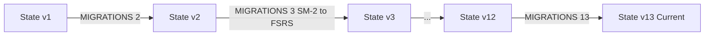

# State Migrations — Конвейер Миграций Данных

В этом документе описывается работа пайплайна автоматических миграций схемы состояния (`state/store.js` и `src/migration.js`).

---

## ⚙️ Пайплайн миграций (`MIGRATIONS`)

При загрузке состояния из IndexedDB или бэкапа проверяется значение `state.version`. Если `version < CURRENT_VERSION` (где `CURRENT_VERSION = 13`), последовательно применяются трансформации из объекта `MIGRATIONS`:

---

## 📜 Ключевые вехи миграций

- **v2 → v3**: Массовый автоматический перевод карточек с алгоритма SM-2 на FSRS (через `SRS.migrateSM2ToFSRS`).
- **v9 → v10**: Введение реестра `vocabularyUnlocks` для поэтапного разблокирования слов по дням.
- **v10 → v11**: Добавление полей интегрированного плана и нормализация устаревших слотов лексики.
- **v11 → v12**: Миграция структуры `dailySnapshot` с поддержкой зафиксированных ID задач.
- **v12 → v13**: Поддержка расширенных review-логов и метаданных context-production.

---

## 🚛 Миграция из localStorage (`src/migration.js`)

При первом старте с новой версией хранилища:

1. Проверяется запись `idb_migrated` в store `ui_preferences`.
2. Если записи нет, читаются устаревшие ключи `kitsune_state_v1` и `kitsune_lessons_v1` из `localStorage`.
3. Состояние сохраняется в IndexedDB, после чего устанавливается флаг `idb_migrated = true`.
