# State Migrations — Конвейер Миграций Данных

В этом документе описывается работа пайплайна автоматических миграций схемы состояния (`state/store.js` и `src/migration.js`).

---

## ⚙️ Пайплайн миграций (`MIGRATIONS`)

При загрузке состояния из IndexedDB или бэкапа проверяется значение
`state.version`. Если `version < STATE_SCHEMA_VERSION` (где
`STATE_SCHEMA_VERSION = 17`, см. [справочник версий](../reference/generated-versions.md)), последовательно применяются трансформации из объекта
`MIGRATIONS`:

```mermaid
graph LR
    V1[State v1] -->|MIGRATIONS 2| V2[State v2]
    V2 -->|MIGRATIONS 3 SM-2 to FSRS| V3[State v3]
    V3 -->|...| V14[State v14]
    V14 -->|MIGRATIONS 15 Course packages| V15[State v15]
    V15 -->|MIGRATIONS 16 Dictionary IDs| V16[State v16]
    V16 -->|MIGRATIONS 17 Pomodoro state| V17[State v17 Current]
```

---

## 📜 Ключевые вехи миграций

- **v2 → v3**: Массовый автоматический перевод карточек с алгоритма SM-2 на FSRS (через `SRS.migrateSM2ToFSRS`).
- **v9 → v10**: Введение реестра `vocabularyUnlocks` для поэтапного разблокирования слов по дням.
- **v10 → v11**: Добавление полей интегрированного плана и нормализация устаревших слотов лексики.
- **v11 → v12**: Миграция структуры `dailySnapshot` с поддержкой зафиксированных ID задач.
- **v12 → v13**: Поддержка расширенных review-логов и метаданных context-production.
- **v13 → v14**: Слияние поздних дублей GENKI I, переназначение ссылок на канонические словарные ID и архивирование исходного прогресса удалённых записей без пересчёта FSRS.
- **v14 → v15**: Namespaced course/lesson/reference ID и разделение прогресса по
  course packages.
- **v15 → v16**: Перенос vocabulary FSRS/mastery/events/session queues на
  глобальные `dictionaryId`. Коллизии карточек разрешаются детерминированно, а
  исходные значения архивируются в `dictionaryMigrationArchive`.
- **v16 → v17**: Нормализация полей Pomodoro таймера и настроек `settings.pomodoro`.

---

## 🚛 Миграция из localStorage (`src/migration.js`)

При первом старте с новой версией хранилища:

1. Проверяется запись `idb_migrated` в store `ui_preferences`.
2. Если записи нет, читаются устаревшие ключи `kitsune_state_v1` и `kitsune_lessons_v1` из `localStorage`.
3. Состояние сохраняется в IndexedDB, после чего устанавливается флаг `idb_migrated = true`.

---

## 🔒 Активные сессии (Active Session Schema Versioning)

Активные сессии обучения персистятся в магазине `active_session` IndexedDB и версионируются отдельно от State schema:

- **`ACTIVE_SESSION_SCHEMA_VERSION = 2`** (экспортируется из `src/app-metadata.js`).
- Валидация и миграция выполняются через Zod-пайплайн (`src/schemas/active-session.js`).
- Старые записи v1 безопасно нормализуются до v2 (каноникализация ID карточек, восстановление счётчиков `stats`, нормализация временных меток).
- Повреждённые или невосстановимые сессии изолируются: сброс сессии не сбрасывает общее состояние FSRS/XP, а диагностическое сообщение сохраняется.

---

## 🧪 Регрессионный контур и Fixtures Policy

Неизменяемые исторические бэкапы хранятся в `tests/fixtures/migrations/`:

- Fixtures являются постоянными снимками исторических состояний (`state-v1`, `sm2-early`, `fsrs-early`, `state-v6`, `state-v13`, `state-v16`, `corrupted-state`, `legacy-active-session`, `idb-fallback-conflict`, `two-tabs-upgrade`).
- Исходные `state.json` / `session.json` файлы являются неизменяемыми регрессионными артефактами.
- Валидация структуры fixtures выполняется перед сборкой командой `npm run fixtures:verify`.
- Запуск регрессионных тестов: `npm run test:migrations`.

---

## ✅ Checklist изменения persistent data

- [ ] Увеличена соответствующая schema version (`STATE_SCHEMA_VERSION`, `INDEXED_DB_VERSION`, `ACTIVE_SESSION_SCHEMA_VERSION`).
- [ ] Добавлена детерминированная миграция в `MIGRATIONS` / `parseAndMigrateActiveSession`.
- [ ] Добавлен fixture предыдущей версии в `tests/fixtures/migrations/`.
- [ ] Добавлены semantic invariant tests в `tests/migrations/migration-fixtures.test.js`.
- [ ] Проверена идемпотентность (`migrate(migrated) === migrated`).
- [ ] Проверен rollback при ошибке IndexedDB транзакции.
- [ ] Проверена версионированная активная сессия.
- [ ] Проверено разрешение конфликтов fallback-копии и защита двух вкладок.
- [ ] Проверена целостность fixtures через `npm run fixtures:verify`.
- [ ] Обновлена документация.
