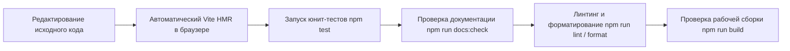

# Development Workflow — Рабочий процесс разработки

В этом документе описан стандартный цикл разработки, сборки и форматирования кода в проекте **Kitsune-GENKI**.

---

## 🔄 Стандартный цикл разработки



---

## 🛠️ Сборка проекта для продакшена

Для сборки проекта используйте команду:

```bash
npm run build
```

При этом автоматически выполняется скрипт `prebuild`:

1. `node scripts/validate-grammar-quizzes.js` — валидирует валидность всех грамматических JSON-тестов.
2. `node scripts/build-kanji-data.js` — собирает данные иероглифов для `hanzi-writer`.
3. `vite build` — компилирует и минифицирует JS/CSS ресурсы в папку `dist/`.

Для предварительного просмотра продакшн-сборки запустите:

```bash
npm run preview
```

---

## 🎨 Линтинг и Форматирование

В проекте используются ESLint v10 и Prettier v3.

- **Проверка линтера**: `npm run lint`
- **Автоматическое исправление ошибок линтера**: `npm run lint:fix`
- **Проверка форматирования кода Prettier**: `npm run format:check`
- **Автоматическое форматирование всего кода**: `npm run format`

---

## ⚓ Git Hooks (Husky & lint-staged)

В проекте настроен Husky (`.husky/`). При совершении `git commit` автоматически запускается `lint-staged`:

- Файлы `*.js` форматируются через Prettier и проверяются ESLint.
