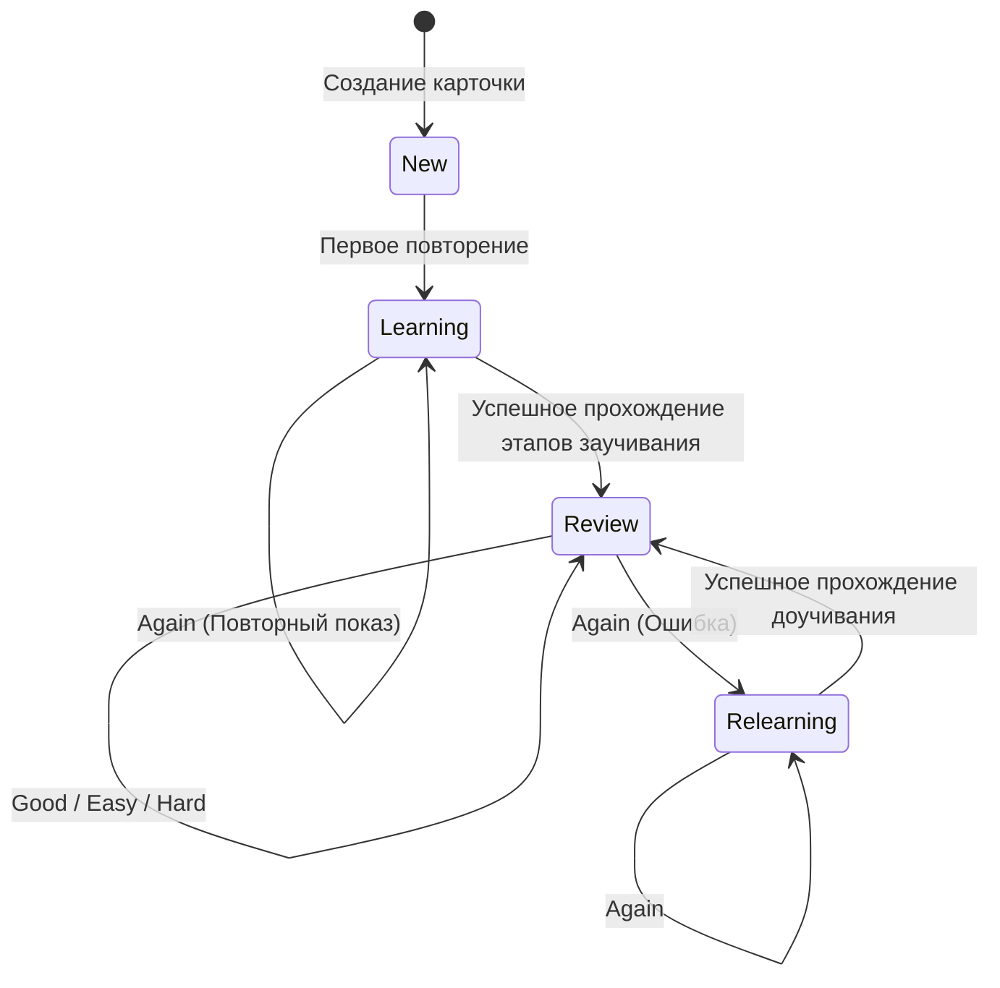

# FSRS Algorithm — Интеграция FSRS v5

В этом документе описывается применение алгоритма Free Spaced Repetition Scheduler (`ts-fsrs` `^5.4.1`) в проекте (`srs.js`, `src/srs-config.js`).

---

## 🧠 Зачем FSRS используется в KotoKitsu

В отличие от устаревшего алгоритма SuperMemo-2 (SM-2), FSRS v5 строит математическую модель памяти на основе двух основных переменных:

1. **Stability ($S$)**: Прогнозируемое время (в днях), за которое вероятность вспомнить карточку снижается с 100% до 90%.
2. **Difficulty ($D$)**: Сложность материала для конкретного пользователя (от 1.0 до 10.0).

---

## 🔄 Состояния карточки FSRS

- **`New` (0)**: Новая карточка, ещё не проходившаяся пользователем.
- **`Learning` (1)**: Карточка находится на этапе первичного усвоения.
- **`Review` (2)**: Карточка находится в основном цикле повторений.
- **`Relearning` (3)**: Карточка после ошибки на этапе Review (увеличивает `lapses`).

---

## 📊 Параметры конфигурации FSRS (`src/srs-config.js`)

- **`request_retention`**: `0.90` (Целевая удерживаемость в памяти 90%).
- **`maximum_interval`**: `365` дней.
- **`w`**: Базовый вектор параметров FSRS v5.

---

## 🛡️ Изоляция от технически повреждённых карточек

Технически непригодные карточки (missing word, missing dictionaryId, corrupt card data) **никогда не оцениваются оценкой Good/Hard/Easy/Again**.
Вызывается изолированный метод `sessionManager.skipCard()`, предотвращающий изменения `due`, `stability` и `difficulty`.
