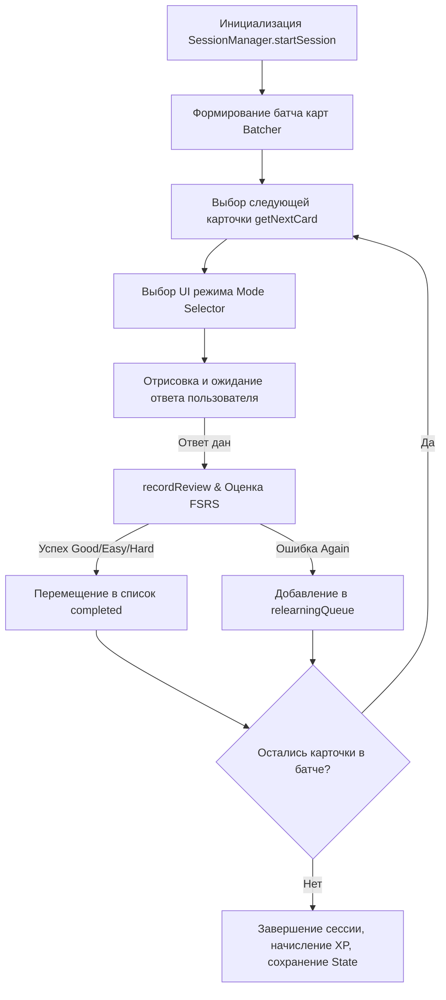

# SessionManager & Execution Flow — Прохождение Сессии

Документ описывает логику работы оркестратора учебной сессии `SessionManager` (`session-manager.js`).

---

## 🔄 Жизненный цикл сессии (Session Lifecycle)

---

## ⏪ Функция отмены хода (Undo)

- `SessionManager` поддерживает стек отмены `undoStack`.
- При нажатии кнопки **Undo** на текущей карточке:
  1. Последний review event извлекается из стека.
  2. Карточка возвращается в предыдущее FSRS-состояние (восстанавливаются `stability`, `difficulty`, `due`).
  3. Отменяется начисление XP за отмененный ответ.
  4. Сессионная очередь возвращает карточку в активное состояние.

---

## 🚫 Технический пропуск карточек (Technical Skip)

При невозможности отобразить карточку (отсутствие слова в словаре, повреждённый `dictionaryId` или неполные данные задания):

- Карточка завершается через `sessionManager.skipCard(cardId)`.
- **FSRS-алгоритм НЕ вызывается**, расписание (`due`, `stability`, `difficulty`, `reps`, `lapses`) остается неизменным.
- **XP, монеты и квесты НЕ начисляются**.
- В статистике сессии событие учитывается в отдельном поле `stats.skipped`.
- Записывается структурированная диагностическая ошибка `UNRENDERABLE_SRS_CARD`.
