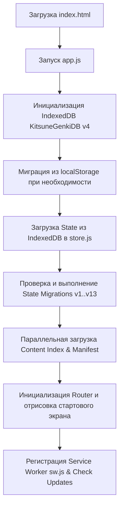

# Application Lifecycle — KotoKitsu

Документ описывает полный жизненный цикл веб-приложения **KotoKitsu**: от момента загрузки `index.html` в браузере до выключения и обновления PWA Service Worker.

---

## 🚀 Этапы инициализации приложения

### 1. Загрузка HTML и скриптов

- Браузер загружает `index.html` с предзагруженными ресурсами и стилями (`styles.css`).
- Загружается главная точка входа `app.js` как ES-модуль.

### 2. Инициализация хранилища (IndexedDB)

- Вызывается `db.initDB()` (`src/db.js`).
- Открывается база `KitsuneGenkiDB` версии 4.
- Если база открывается впервые с legacy-версии, запускается `migrateFromLocalStorage()` (`src/migration.js`), переносящая старые ключи `kitsune_state_v1` из `localStorage` в store `app_state`.

### 3. Загрузка и миграция состояния

- Из IndexedDB читается сохранённый snapshot состояния `state`.
- Если сохранённое состояние отсутствует, генерируется `defaultState()` (`state/store.js`).
- Выполняется цепочка миграций `MIGRATIONS` до `CURRENT_VERSION = 13`.
- Подтверждённое состояние сохраняется обратно в хранилище.

### 4. Инициализация контента и роутинга

- Загружается индекс контента `content-index.json` (`src/content-loader.js`).
- Запускается роутер `initRouter()` (`router.js`).
- Проверяется статус онбординга (`state.onboardingCompleted`). Если онбординг не пройден, пользователя перенаправляет на маршрут `#/onboarding`, иначе на `#/home`.

### 5. Регистрация PWA Service Worker

- Вызывается `initSWUpdateManager()` (`src/sw-update-manager.js`).
- Регистрируется `public/sw.js`.
- При обнаружении новой версии выводится уведомление о готовом обновлении.

---

## 🔄 Жизненный цикл учебной сессии

1. **Вход в сессию**: Пользователь нажимает «Начать повторение» на главном экране или в плане.
2. **Инициализация SessionManager**: `SessionManager.startSession(cards, options)` создаёт батч карточек (по умолчанию батч из 10-20 карточек).
3. **Прохождение батча**: Каждая карточка показывается через UI рендерер соответствующего режима.
4. **Фиксация результатов**: Каждый ответ вызывает `recordReview`, обновляет состояние и асинхронно сбрасывает транзакцию в IndexedDB.
5. **Завершение**: Пользователю выводится экран итогов сессии с полученным XP, точностью и кнопкой перехода на главный экран.

---

## 🛑 Завершение работы и синергия вкладок

- При закрытии или сворачивании вкладки событие `visibilitychange` и `beforeunload` инициируют принудительное сохранение несохранённых данных из оутбокса.
- Канал `BroadcastChannel('kitsune_tab_sync')` контролирует, чтобы открытые вкладки синхронизировали изменения и не перезаписывали состояние друг друга.
