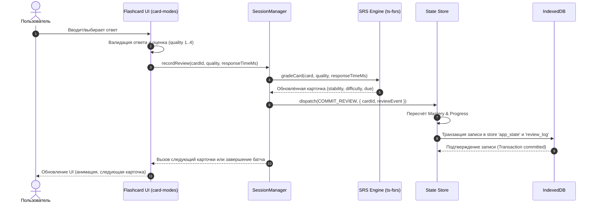

# Architecture & Data Flow — KotoKitsu

В этом документе представлена общая архитектура веб-приложения **KotoKitsu**, взаимодействие его слоёв, Composition Root и автоматизированные границы слоёв.

---

## 🏗️ Слойность архитектуры

Приложение построено по принципам чистой слоистой архитектуры (Clean Architecture) в рамках SPA на Vanilla JS:

```text
+-------------------------------------------------------+
|                   Composition Root                    |
|                        (app.js)                       |
+-------------------------------------------------------+
                           │
                           ▼
+-------------------------------------------------------+
|                    Bootstrap Layer                    |
|        (bootstrap/bootstrap-application.js)           |
+-------------------------------------------------------+
             ┌─────────────┴─────────────┐
             ▼                           ▼
+-------------------------+ +---------------------------+
|        UI Shell         | |    Legacy Window Adapter  |
|     (ui/app-shell.js)   | | (adapters/legacy-window) |
+-------------------------+ +---------------------------+
             │
             ▼
+-------------------------------------------------------+
|                       UI Layer                        |
|   (Router, Views, Flashcards Renderers, Modals)       |
+-------------------------------------------------------+
                           │
                           ▼
+-------------------------------------------------------+
|                 Session Orchestration                 |
|   (SessionManager, Review Queue, Batcher, Undo)       |
+-------------------------------------------------------+
                           │
                           ▼
+-------------------------------------------------------+
|                State & Persistence                    |
|   (Store, Outbox, Migrations, IndexedDB)              |
+-------------------------------------------------------+
                           │
                           ▼
+-------------------------------------------------------+
|                    Domain Logic                       |
|   (FSRS, Mastery, Study Plan, Daily Plan, A11y)       |
+-------------------------------------------------------+
                           │
                           ▼
+-------------------------------------------------------+
|                    Content Engine                     |
|   (Content Loader, Lessons JSON, Schema Validation)   |
+-------------------------------------------------------+
```

---

## 🎯 Composition Root & Bootstrap Lifecycle

1. **`app.js` (Composition Root)**:
   - Содержит всего ~25 строк чистого кода декларации контейнера зависимостей и запуска.
   - Собирает зависимости через `createProductionDependencies()`, запускает `bootstrapApplication(dependencies)` и обрабатывает фатальные ошибки через `handleFatalBootstrapError()`.

2. **`bootstrap/` (Bootstrap Layer)**:
   - `bootstrap-application.js`: Оркестратор последовательности старта (загрузка State, миграции, адаптеры, SW, глобальные ивенты, монтирование UI Shell).
   - `production-dependencies.js`: Контейнер зависимости приложения.
   - `create-application-runtime.js`: Контейнер рантайма (`core`, `features`, `platform`, `diagnostics`).
   - `initialize-state.js`, `initialize-courses.js`, `initialize-service-worker.js`, `register-global-events.js`, `handle-bootstrap-error.js`.

3. **`adapters/legacy-window-api.js` & `architecture/legacy-window-api.json`**:
   - Единственная точка в приложении, где разрешена запись в глобальный объект `window`.
   - Реестр `legacy-window-api.json` документирует все явные экспортные методы для обратной совместимости.
   - Вся запись проверяется скриптом `scripts/check-legacy-globals.js`.

4. **`state/migrations/`**:
   - Модульные файловые миграции (`migrate-v1-to-v2.js` ... `migrate-v16-to-v17.js`).
   - `state/migrations/index.js` выполняет автоматическую валидацию непрерывности цепочки миграций.

---

## 🔄 Поток данных прохождения карточки (Card Review Flow)



---

## 🛡️ Архитектурные правила и инварианты

1. **Composition Root & Безглобальность**:
   - Приложение стартует через `bootstrapApplication()`.
   - Запись в `window.*` запрещена во всех файлах кроме `adapters/legacy-window-api.js` и `src/dev-tools.js`. Проверяется с помощью `npm run architecture:globals`.

2. **Запрет циклических зависимостей и контроль границ слоёв**:
   - Контролируется инструментом `dependency-cruiser` (`dependency-cruiser.config.cjs`).
   - Команда проверки: `npm run architecture:check`.

3. **Единственный источник истины**:
   - В памяти — `state` в `state/store.js`.
   - На диске — `KitsuneGenkiDB` в IndexedDB store `app_state`.
   - Все остальные отображения рассчитываются как **derived data**.
