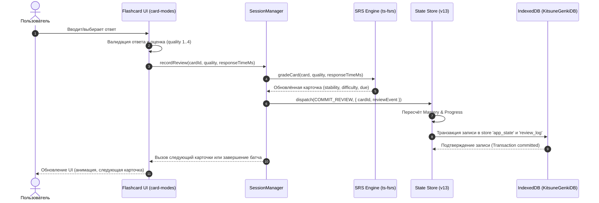

# Architecture & Data Flow — Kitsune-GENKI

В этом документе представлена общая архитектура веб-приложения **Kitsune-GENKI**, взаимодействие его слоев и потоки данных.

---

## 🏗️ Слойность архитектуры

Приложение построено по принципам чистой слоистой архитектуры (Clean Architecture) в рамках SPA на Vanilla JS:

```text
+-------------------------------------------------------+
|                       PWA Shell                       |
|   (Index.html, Service Worker, Web App Manifest)      |
+-------------------------------------------------------+
                           │
                           ▼
+-------------------------------------------------------+
|                       UI Layer                        |
|   (Router, Views, Flashcards Renderers, Modals)       |
+-------------------------------------------------------+
                           │
                           ▼
+-------------------------------------------------------+
|                 Session Orchestration                 |
|   (SessionManager, Review Queue, Batcher, Undo)       |
+-------------------------------------------------------+
                           │
                           ▼
+-------------------------------------------------------+
|                State & Persistence                    |
|   (Store v13, Outbox, IndexedDB v4, Review Journal)   |
+-------------------------------------------------------+
                           │
                           ▼
+-------------------------------------------------------+
|                    Domain Logic                       |
|   (FSRS, Mastery, Study Plan, Daily Plan, A11y)       |
+-------------------------------------------------------+
                           │
                           ▼
+-------------------------------------------------------+
|                    Content Engine                     |
|   (Content Loader, Lessons JSON, Schema Validation)   |
+-------------------------------------------------------+
```

---

## 🔄 Поток данных прохождения карточки (Card Review Flow)

Ниже представлена диаграмма последовательности прохождения карточки пользователем в рамках учебной сессии:



---

## 🛡️ Архитектурные правила и инварианты

1. **Единственный источник истины**:
   - В памяти — `state` в `state/store.js`.
   - На диске — `KitsuneGenkiDB` в IndexedDB store `app_state`.
   - Все остальные отображения (View Models, списки на экране) рассчитываются как **derived data** (производные данные).

2. **Транзакционность и Outbox**:
   - При совершении FSRS review запись пишется атомарно в лог `review_log` и объект `state.srs[cardId]`.
   - В случае сбоя или закрытия вкладки несохранённые события синхронизируются из transactional outbox при следующем запуске.

3. **Независимость SRS от UI-режима**:
   - Алгоритм `ts-fsrs` получает стандартизированную оценку (Rating: Again, Hard, Good, Easy) независимо от того, проходилась ли карточка в режиме ввода с клавиатуры или выбора вариантов.
