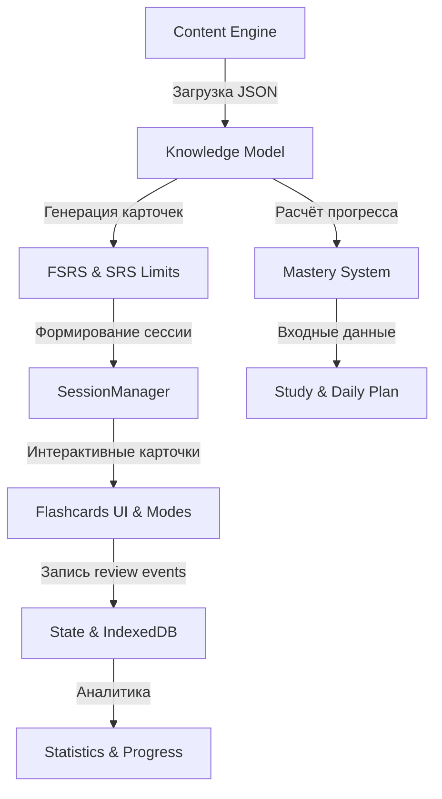

# Project Overview — KotoKitsu

**KotoKitsu** — это автономное Progressive Web Application (PWA) для комплексого изучения японского языка на основе популярной серии учебников Genki (Genki I и II).

---

## 🎯 Назначение приложения

Главная цель приложения — предоставить студентам эффективный, офлайн-доступный инструмент для освоения лексики, грамматики, иероглифики (кандзи) и практического построения предложений без зависимости от сторонних серверов или постоянного интернет-соединения.

### Ключевые ценности:

1. **Offline-First**: Полная функциональность приложения (обучение, повторение, словарь, мини-игры) работает в автономном режиме без подключения к сети.
2. **Научный подход к памяти**: Использование современного алгоритма `ts-fsrs` (Free Spaced Repetition Scheduler v5) для оптимального планирования интервалов повторения.
3. **Разделение Повторения и Мастерства**: Чёткое разграничение между техническим графиком FSRS (retrievability/due) и долгосрочным уровнем освоения навыка (Mastery).
4. **Контекстная практика**: Фокус на реальном использовании языка через режимы Context Sentence и Context Production вместо изолированного заучивания слов.
5. **Высокая производительность и быстродействие**: Использование чистейшего Vanilla JavaScript (ES Modules) без накладных расходов тяжелых UI-фреймворков.

---

## 🛠️ Технологический стек

- **Frontend Engine**: Vanilla JavaScript (ES2022 / ES Modules).
- **Сборка и Dev-сервер**: Vite 5.
- **База данных на клиенте**: IndexedDB с фаллбэком на localStorage (актуальные версии приведены в [справочнике версий](../reference/generated-versions.md)).
- **Алгоритм SRS**: `ts-fsrs` (версия `^5.4.1`).
- **Отрисовка кандзи**: `hanzi-writer` + `@k1low/hanzi-writer-data-jp`.
- **Стилевое оформление**: Vanilla CSS3 с кастомными переменными темы, поддержкой темной темы и анимированных микро-взаимодействий.
- **Тестирование**: Vitest (юнит/интеграция, 90+ тестовых файлов), Playwright (E2E и мобильные сценарии), `@axe-core/playwright` (автоматизированное тестирование доступности).
- **PWA & Cache Management**: Custom Service Worker (`public/sw.js`) с нативным управлением жизненным циклом обновлений.
- **AI-расширение (Опционально)**: OpenRouter API (модели Claude/GPT) для автономной генерации связных историй (AI Story Generator).

---

## 📐 Ключевые функциональные подсистемы

1. **Knowledge & Card Model**: Единый реестр лексических, грамматических и кандзи элементов. Автоматическая генерация skill-карточек (`kanji-reading`, `vocabulary-meaning`, `writing`, `context-production` и др.).
2. **Session Manager**: Модуль управления учебным процессом, организующий карточки в батчи, обрабатывающий ошибки, очереди повторного заучивания (relearning) и атомарный Undo.
3. **Study & Daily Plan**: Динамический расчёт учебного плана с учётом доступных дней, целевой даты, резервов повторения и staged skill opening (поэтапного разблокирования навыков).
4. **Interactive Modes**: 7 специализированных режимов (Multiple Choice, Active Typing, Drawing Mode, Context Sentence, Context Production, Particle Quiz, Sentence Building).
5. **Minigames**: Набор игр для вспомогательной практики (Crossword, Word Search, Particles game), работающих с Weak Word Selection.

---

## 🏛️ Главные архитектурные инварианты

- **Код — единственный источник истины**. Любая документация обязана соответствовать поведению кода.
- **Чистые доменные функции**: Доменная логика (FSRS, расчет плана, подсчет mastery, квалификация ответов) изолирована от DOM и UI.
- **Идемпотентность сохраненных событий**: Повторная обработка одного и того же `eventId` не приводит к дублированию опыта (XP) или искажению статистики.
- **Изоляция мини-игр от FSRS**: Результаты вспомогательных мини-игр не меняют FSRS stability/difficulty карточек.
