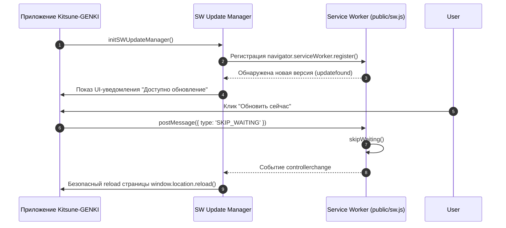

# SW Update Lifecycle — Управление Обновлениями PWA

В этом документе опиcана механика обнаружения и применения обновлений Service Worker (`src/sw-update-manager.js`).

---

## 🔄 Поток обновления Service Worker

Пользовательские данные в IndexedDB гарантированно сохраняются при перезагрузке приложения.
